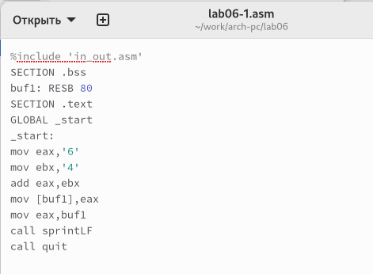
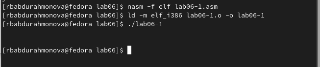
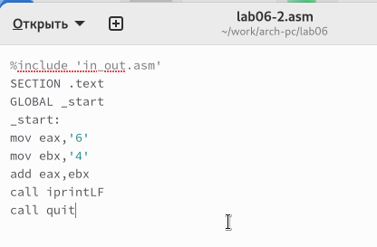
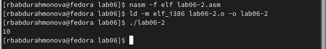
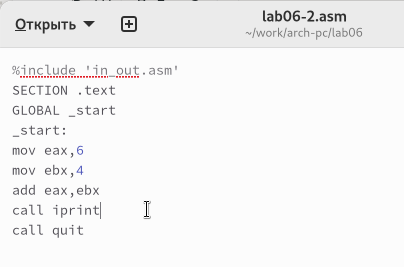
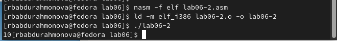

---
## Front matter
title: "Отчёт по лабораторной работе 6"
subtitle: "Архитектура компьютера"
author: "Абдурахмонова Рухшона Бахтиёровна"

## Generic otions
lang: ru-RU
toc-title: "Содержание"

## Bibliography
bibliography: bib/cite.bib
csl: pandoc/csl/gost-r-7-0-5-2008-numeric.csl

## Pdf output format
toc: true # Table of contents
toc-depth: 2
lof: true # List of figures
lot: true # List of tables
fontsize: 12pt
linestretch: 1.5
papersize: a4
documentclass: scrreprt
## I18n polyglossia
polyglossia-lang:
  name: russian
  options:
	- spelling=modern
	- babelshorthands=true
polyglossia-otherlangs:
  name: english
## I18n babel
babel-lang: russian
babel-otherlangs: english
## Fonts
mainfont: PT Serif
romanfont: PT Serif
sansfont: PT Sans
monofont: PT Mono
mainfontoptions: Ligatures=TeX
romanfontoptions: Ligatures=TeX
sansfontoptions: Ligatures=TeX,Scale=MatchLowercase
monofontoptions: Scale=MatchLowercase,Scale=0.9
## Biblatex
biblatex: true
biblio-style: "gost-numeric"
biblatexoptions:
  - parentracker=true
  - backend=biber
  - hyperref=auto
  - language=auto
  - autolang=other*
  - citestyle=gost-numeric
## Pandoc-crossref LaTeX customization
figureTitle: "Рис."
tableTitle: "Таблица"
listingTitle: "Листинг"
lofTitle: "Список иллюстраций"
lotTitle: "Список таблиц"
lolTitle: "Листинги"
## Misc options
indent: true
header-includes:
  - \usepackage{indentfirst}
  - \usepackage{float} # keep figures where there are in the text
  - \floatplacement{figure}{H} # keep figures where there are in the text
---

# Цель работы

Целью работы является освоение арифметических инструкций языка ассемблера NASM.

# Выполнение лабораторной работы

## Символьные и численные данные в NASM

Создала каталог для программ лабораторной работы №6, перешла в него и создала 
файл с названием "lab6-1.asm".

Рассмотрим примеры программ вывода символьных и численных значений. 
Программы будут выводить значения, записанные в регистр eax.

В данной программе, в регистр eax записан символ '6', а в регистр ebx символ '4'. 
Затем мы прибавляем значение регистра ebx к значению в регистре eax (результат 
сложения будет записан в регистр eax). После этого мы выводим результат.

Так как для работы функции sprintLF в регистр eax должен быть записан адрес, 
мы используем дополнительную переменную. Мы записали значение регистра eax в 
переменную с именем "buf1", а затем записали адрес переменной buf1 в регистр eax 
и вызвали функцию sprintLF.

{ #fig:001 width=70%, height=70% }

{ #fig:002 width=70%, height=70% }

В данном случае, при выводе значения регистра eax, ожидалось увидеть число 10. 
Однако, результатом был символ 'j'. Это произошло потому, что код символа 6 
равен 00110110 в двоичном представлении (или 54 в десятичном представлении), а 
код символа 4 – 00110100 (52). Команда add eax, ebx записала в регистр eax 
сумму кодов – 01101010 (106), что в свою очередь является кодом символа 'j'.

Далее был изменен текст программы и вместо символов записаны числа.

{ #fig:003 width=70%, height=70% }

{ #fig:004 width=70%, height=70% }

В процессе выполнения программы не получили ожидаемое число 10. 
Вместо этого был выведен символ с кодом 10. Это символ конца строки 
(возврат каретки), который в консоли не отображается, но добавляет пустую строку.

В файле "in_out.asm" реализованы подпрограммы для работы с числами и 
преобразования символов ASCII. Был модифицирован текст программы с 
использованием этих функций.

{ #fig:005 width=70%, height=70% }

{ #fig:006 width=70%, height=70% }

В результате выполнения обновленной программы было выведено число 106. Здесь, 
как и в первом случае, 
команда add складывает коды символов '6' и '4' (54 + 52 = 106). Но в отличие от 
предыдущей версии, функция iprintLF позволяет напечатать само число, а не символ 
с соответствующим кодом.

По аналогии с предыдущим примером, были заменены символы на числа.

{ #fig:007 width=70%, height=70% }

Функция iprintLF позволяет выводить числа, и на этот раз в качестве 
операндов использовались именно числа, а не коды символов. 
В результате мы получили число 10.

{ #fig:008 width=70%, height=70% }

Далее была заменена функция iprintLF на iprint, создан исполняемый файл и 
запущен. Вывод теперь отличается отсутствием перехода на новую строку.

{ #fig:009 width=70%, height=70% }

{ #fig:010 width=70%, height=70% }

## Выполнение арифметических операций в NASM

В качестве примера выполнения арифметических операций в NASM рассмотрим 
программу для вычисления арифметического выражения $$f(x) = (5 * 2 + 3)/3$$. 

{ #fig:011 width=70%, height=70% }

{ #fig:012 width=70%, height=70% }

Изменила текст программы для вычисления выражения $$f(x) = (4 * 6 + 2)/5$$. 
Создала исполняемый файл и проверила его работу. 

{ #fig:013 width=70%, height=70% }

{ #fig:014 width=70%, height=70% }

В качестве еще одного примера рассмотрим программу для вычисления варианта задания на основе номера студенческого билета. 

В этом случае число, над которым нужно выполнять арифметические операции, 
вводится с клавиатуры. Как уже отмечалось ранее, ввод с клавиатуры 
осуществляется в символьном виде. Для корректной работы арифметических 
операций в NASM эти символы необходимо преобразовать в числовой формат. 
С этой целью можно использовать функцию atoi из файла in_out.asm. 
Она конвертирует строку символов в эквивалентное десятичное число.

{ #fig:015 width=70%, height=70% }

{ #fig:016 width=70%, height=70% }

### Ответы на вопросы по программе variant.asm

1. Какие строки листинга отвечают за вывод на экран сообщения ‘Ваш вариант:’?

Ответ: Строки, отвечающие за вывод сообщения "Ваш вариант:", - это строки, где происходит перемещение фразы в регистр eax с помощью инструкции mov eax, rem, а затем вызов подпрограммы вывода строки с помощью инструкции call sprint.

2. Для чего используется следующие инструкции?

Ответ:

- mov ecx, x: Инструкция mov ecx, x используется для сохранения значения регистра ecx в переменной x.

- mov edx, 80: Инструкция mov edx, 80 используется для присваивания значения 80 регистру edx.

- call sread: Инструкция call sread используется для вызова подпрограммы, которая считывает данные из консоли.

3. Для чего используется инструкция “call atoi”?

Ответ: Инструкция call atoi используется для преобразования введенных символов в числовой формат.

4. Какие строки листинга отвечают за вычисления варианта?

Ответ: Строки, отвечающие за вычисление варианта, включают следующие инструкции:

- xor edx, edx: Инструкция xor edx, edx используется для обнуления регистра edx.

- mov ebx, 20: Инструкция mov ebx, 20 используется для присваивания значения 20 регистру ebx.

- div ebx: Инструкция div ebx используется для деления номера студента на 20.

- inc edx: Инструкция inc edx используется для увеличения значения регистра edx на 1.

5. В какой регистр записывается остаток от деления при выполнении инструкции “div ebx”?

Ответ: При выполнении инструкции div ebx остаток от деления записывается в регистр edx.

6. Для чего используется инструкция “inc edx”?

Ответ: Инструкция inc edx используется для увеличения значения регистра edx на 1, что необходимо для вычисления варианта по формуле.

7. Какие строки листинга отвечают за вывод на экран результата вычислений? 

Ответ: Строки, отвечающие за вывод на экран результата вычислений, включают следующие инструкции:

- mov eax, edx: Инструкция mov eax, edx используется для помещения результата в регистр eax.

- call iprintLF: Инструкция call iprintLF используется для вызова подпрограммы вывода результата.

## Выполнение заданий для самостоятельной работы

Написала программу для вычисления выражения y = f(x). 
Программа выводит выражение для вычисления, запрашивает ввод значения x, 
вычисляет заданное выражение в зависимости от введенного x и выводит результат 
вычислений. Для выбора вида функции f(x) использовала таблицу 6.3 вариантов 
заданий, в соответствии с номером, полученным при выполнении лабораторной работы. 

Создала исполняемый файл и проверила его работу для значений x1 и x2 из таблицы 6.3.

Вариант 3 - $(2 + x )^2$  для $x=2, x=8$ 

{ #fig:017 width=70%, height=70% }

{ #fig:018 width=70%, height=70% }

Программа считает верно.

# Выводы

Изучили работу с арифметическими операциями.